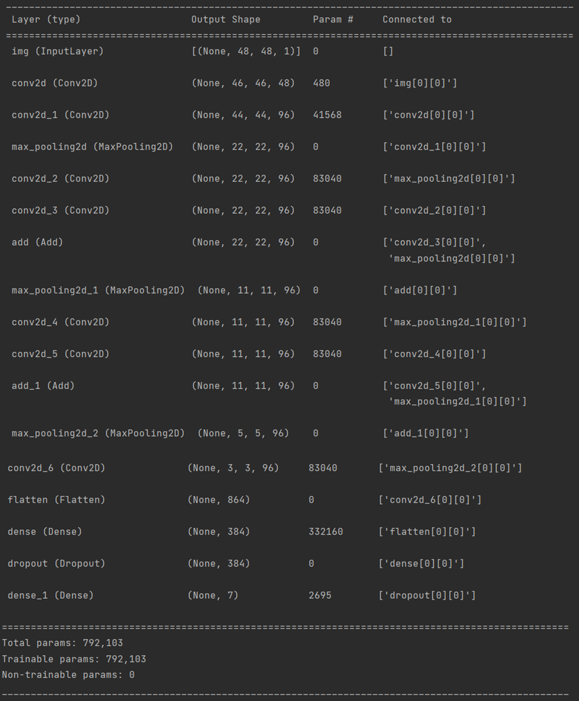
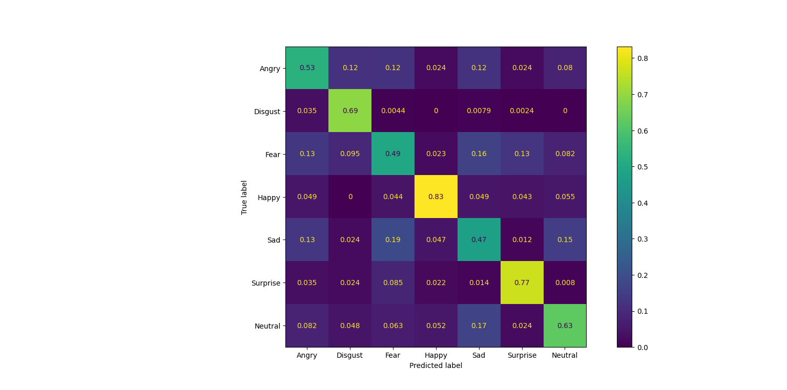

# Face expression recognition application

This repository contains a Django web app. It has registration/authorization system, profile page and recognition page. Recognition page allows an authorized user to upload an image. Application finds faces on an uploaded image and recognizes face expressions of these faces. User can download new image with faces and expressions recognized.

### Neural network models description

------------

To find faces on the given image, application uses pre-trained tensorflow implementation of MTCNN.

To recognize face expressions, own model was built based on keras docs example of a toy ResNet https://www.tensorflow.org/guide/keras/functional#a_toy_resnet_model:

Model was trained on an augmented with 30 deg rotation and 0.1 translation FER2013 dataset. 

It achieved 0.6381 accuracy and 0.636 f1-score on a private test and has a confusion matrix, shown below:

